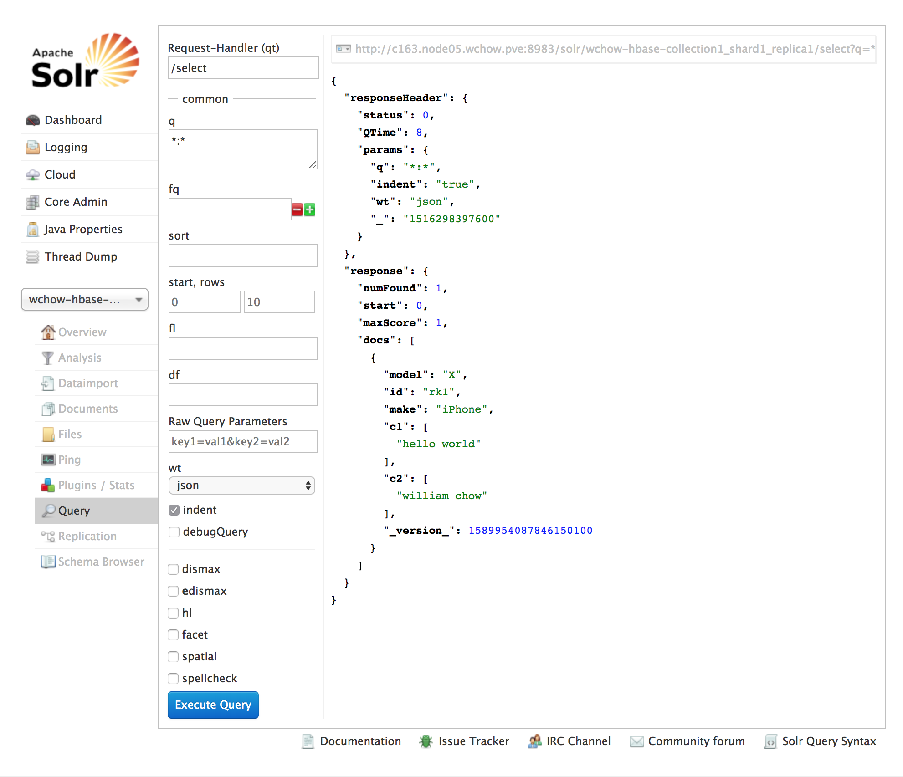

## Indexing HBase Tables in Near Real Time using the Lily HBase NRT Indexer Service


### 1) Add the Key-Value Store Indexer Service in CM
https://www.cloudera.com/documentation/enterprise/latest/topics/cm_mc_indexer_service.html  
CM will enable HBase replication and will point the Lily HBase NRT Indexer Service at an HBase Cluster
i.e. you do NOT have to edit the /etc/hbase-solr/conf/hbase-indexer-site.xml file manually. CM will do it for you.

### 2) Create or alter HBase table with replication on for column family
https://www.cloudera.com/documentation/enterprise/latest/topics/search_use_hbase_indexer_service.html
```
hbase(main):003:0> create 'tbl1', {NAME => 'cf1' , REPLICATION_SCOPE => 1}, {NAME => 'cf2', REPLICATION_SCOPE => 1}
0 row(s) in 2.3310 seconds

=> Hbase::Table - tbl1
hbase(main):004:0> desc 'tbl1'
Table tbl1 is ENABLED
tbl1
COLUMN FAMILIES DESCRIPTION
{NAME => 'cf1', BLOOMFILTER => 'ROW', VERSIONS => '1', IN_MEMORY => 'false', KEEP_DELETED_CELLS => 'FALSE', DATA_BLOCK_E
NCODING => 'NONE', TTL => 'FOREVER', COMPRESSION => 'NONE', MIN_VERSIONS => '0', BLOCKCACHE => 'true', BLOCKSIZE => '655
36', REPLICATION_SCOPE => '1'}
{NAME => 'cf2', BLOOMFILTER => 'ROW', VERSIONS => '1', IN_MEMORY => 'false', KEEP_DELETED_CELLS => 'FALSE', DATA_BLOCK_E
NCODING => 'NONE', TTL => 'FOREVER', COMPRESSION => 'NONE', MIN_VERSIONS => '0', BLOCKCACHE => 'true', BLOCKSIZE => '655
36', REPLICATION_SCOPE => '1'}
2 row(s) in 0.0470 seconds
```

### 3) Creating a Corresponding Collection in Search
https://www.cloudera.com/documentation/enterprise/latest/topics/search_hbase_batch_indexer.html

Before indexing the data, you need to do the following 4 steps (required regardless of which indexing method you use)

DO THIS ON A SolrCloud node
1. Generate configuration files from a template
```
solrctl instancedir --generate $HOME/wchow-hbase-collection1
```

2. Editing the Schema / Edit the configuration files according to the data you want to index
```
vi $HOME/wchow-hbase-collection1/conf/schema.xml
```

3. Creating the Instance Directory / Upload the configuration files to ZooKeeper
  
```
solrctl --zk c160.node02.wchow.pve:2181,c161.node03.wchow.pve:2181,c162.node04.wchow.pve:2181/solr instancedir --create wchow-hbase-collection1 $HOME/wchow-hbase-collection1
```
NOTE: for the --zk option, specify multiple ZooKeeper hosts in a production environment and list out all the ZK nodes
When you have a list (E.g. --zk node01:2181,node05:2181,node08:2181/solr) it will only go to 1 ZK and if that is not accessible it will go down the list (left to right) to the next ZK

4. Creating the collection / Create a collection to hold the index
  
```
solrctl --zk c160.node02.wchow.pve:2181,c161.node03.wchow.pve:2181,c162.node04.wchow.pve:2181/solr collection --create wchow-hbase-collection1 -s 3
```

### 4) Creating a Lily HBase Indexer Configuration
https://www.cloudera.com/documentation/enterprise/latest/topics/search_hbase_batch_indexer.html#concept_q3l_2tb_4r
```
<?xml version="1.0"?>
<indexer
   table="tbl1"
   mapper="com.ngdata.hbaseindexer.morphline.MorphlineResultToSolrMapper"
   mapping-type="row">

   <!-- The relative or absolute path on the local file system to the
   morphline configuration file. -->
   <!-- Use relative path "morphlines.conf" for morphlines managed by
   Cloudera Manager -->
   <param name="morphlineFile" value="morphlines.conf"/>

</indexer>
```

### 5) Morphline Configuration File
https://www.cloudera.com/documentation/enterprise/latest/topics/search_hbase_batch_indexer.html#concept_wst_2tb_4r
  
Do this in CM  
Text that goes into morphlines.conf file used by HBase Indexers. The text goes verbatim into the config file except that $ZK_HOST is replaced by the ZooKeeper quorum of the Solr service.
```
# If you are using Cloudera Manager, then this goes within Cloudera Manager
#   In CM ->  Key-Value Store Indexer service > Configuration > Category > Morphlines > Morphlines File

SOLR_LOCATOR : {
  # Name of solr collection
  collection : wchow-hbase-collection1

  # ZooKeeper ensemble
  zkHost : "$ZK_HOST"
}

morphlines : [
{
id : morphline
importCommands : ["org.kitesdk.**", "com.ngdata.**"]

commands : [
  {
    extractHBaseCells {
      mappings : [
        {
          inputColumn : "cf1:*"
          outputField : "*"
          type : string
          source : value
        }
      ]
    }
  }
  { sanitizeUnknownSolrFields { solrLocator : ${SOLR_LOCATOR} } }
  { logDebug { format : "output record: {}", args : ["@{}"] } }
]
}
]
```
Restart the service

### 6) Registering a Lily HBase Indexer Configuration with the Lily HBase Indexer Service
https://www.cloudera.com/documentation/enterprise/latest/topics/search_use_hbase_indexer_service.html#concept_ph2_yqw_hbb

List Indexes - Before:
```
# hbase-indexer list-indexers --zookeeper c161.node03.wchow.pve:2181,c160.node02.wchow.pve:2181,c162.node04.wchow.pve:2181
Number of indexes: 0
```

Run this:
NOTE: you can run hbase-indexer on any node but run it where the Lily HBase Indexer Configuration is  
```
hbase-indexer add-indexer \
--name wchowIndexer \
--indexer-conf $HOME/wchow-hbase-collection1/wchow-morphline-hbase-mapper.xml \
--connection-param solr.zk=c160.node02.wchow.pve:2181,c161.node03.wchow.pve:2181,c162.node04.wchow.pve:2181/solr \
--connection-param solr.collection=wchow-hbase-collection1 \
--zookeeper c161.node03.wchow.pve:2181,c160.node02.wchow.pve:2181,c162.node04.wchow.pve:2181
```

List Indexes - After:
```
# hbase-indexer list-indexers --zookeeper c131.node03.wchow.pve:2181,c130.node02.wchow.pve:2181,c132.node04.wchow.pve:2181
Number of indexes: 1

wchowIndexer
  + Lifecycle state: ACTIVE
  + Incremental indexing state: SUBSCRIBE_AND_CONSUME
  + Batch indexing state: INACTIVE
  + SEP subscription ID: Indexer_wchowIndexer
  + SEP subscription timestamp: 2017-09-28T15:29:46.128-04:00
  + Connection type: solr
  + Connection params:
    + solr.collection = wchow-hbase-collection1
    + solr.zk = c130.node02.wchow.pve:2181,c131.node03.wchow.pve:2181,c132.node04.wchow.pve:2181/solr
  + Indexer config:
      415 bytes, use -dump to see content
  + Indexer component factory: com.ngdata.hbaseindexer.conf.DefaultIndexerComponentFactory
  + Additional batch index CLI arguments:
      (none)
  + Default additional batch index CLI arguments:
      (none)
  + Processes
    + 1 running processes
    + 0 failed processes
```

### 7) Verifying that Indexing Works
```
hbase(main):002:0> put 'tbl1', 'rk1', 'cf1:c1', 'hello world'
0 row(s) in 0.2150 seconds

hbase(main):003:0> put 'tbl1', 'rk1', 'cf1:c2', 'william chow'
0 row(s) in 0.0200 seconds

hbase(main):004:0> put 'tbl1', 'rk1', 'cf1:make', 'iPhone'
0 row(s) in 0.0400 seconds

hbase(main):005:0> put 'tbl1', 'rk1', 'cf1:model', 'X'
0 row(s) in 0.0190 seconds

hbase(main):006:0> get 'tbl1', 'rk1'
COLUMN                          CELL
 cf1:c1                         timestamp=1511388751692, value=hello world
 cf1:c2                         timestamp=1511388757122, value=william chow
 cf1:make                       timestamp=1511388762452, value=iPhone
 cf1:model                      timestamp=1511388766795, value=X
4 row(s) in 0.0410 seconds
```

In Solr Admin

